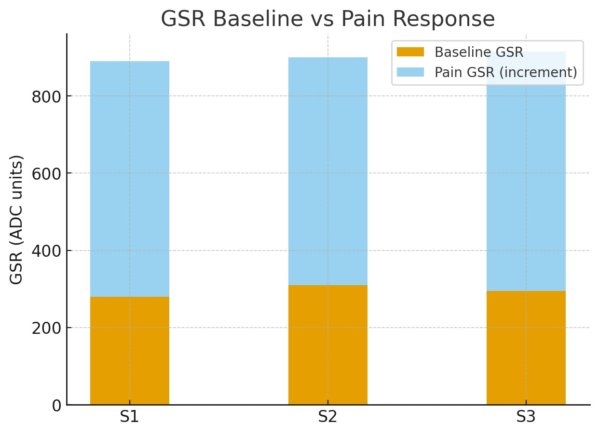

# PainMeter
Pain assessment and management remain major challenges in healthcare, as conventional tools such as the Visual Analog Scale and Numerical Rating Scale depend entirely on patient self reporting. These subjective methods are often unreliable, especially for patients who are unconscious, non verbal, or unable to communicate effectively. To address this gap, this project proposes a dual-function device capable of both pain detection and Tens Machine for pain relief.
# Project Description
This project presents a multisensor-based embedded system to estimate pain-related physiological responses and provide assistive pain relief therapy. The system integrates temperature, heart rate, and EMG sensors to observe physiological patterns associated with pain and stress. An ESP32 microcontroller collects and processes the sensor data and infers a probable pain condition using combined sensor analysis. The system does not directly measure pain but estimates it based on physiological indicators. Based on the inferred condition, a commercially certified TENS therapy module is activated for assistive pain relief. Local visualization is provided using an LCD/OLED display, with optional IoT support for remote monitoring.
# System Overview
The system consists of two integrated modules: Pain Detection and Ultrasonic Therapy. The ESP32 microcontroller serves as the central hub, collecting data, analyzing signals, and triggering therapy while simultaneously uploading results to Blynk Cloud.
## Pain Detection Sensors
GSR Sensor – Measures changes in skin resistance; higher conductance indicates sympathetic activation during pain.
EMG Sensor – Captures electrical muscle signals; abnormal spikes indicate pain-related muscle activity.
MAX30102 – Provides heart rate and oxygen saturation, both of which change during pain.
EMG (Electromyography) sensor – Measures muscle activation by sensing electrical signals generated during muscle contraction.
## AI/ML Module
A camera module captures the subject’s facial expressions.
Pre-trained CNN models detect pain-related expressions (eyebrow contraction, eye squeeze, mouth grimacing).
ML integration ensures the system adapts to individual pain tolerance, reducing false positives.
## Therapy Module
A TENS (Transcutaneous Electrical Nerve Stimulation) module is used to deliver low-voltage electrical pulses.
Activated automatically upon confirmed pain detection or manually via a control button.
Provides safe, non-invasive, drug-free pain relief by modulating nerve signals and reducing pain perception.
## IoT Integration
Blynk Cloud stores and visualizes sensor readings in real time.
Clinicians can monitor pain events, heart rate trends, and therapy sessions remotely through a smartphone app.
## Working 
The system continuously monitors physiological signals such as heart rate, EMG, and body temperature using wearable sensors. A thermal camera identifies localized temperature hotspots associated with inflammation or pain. All sensor data is processed by a controller to estimate the pain condition in real time. When predefined thresholds are exceeded, the system automatically triggers or recommends TENS therapy at the identified location. The therapy can be adjusted or controlled wirelessly through a mobile application for safety and effectiveness.

  

<h2 align="center">Process Flow</h2>

  

# Observations and Results

|Parameter|Baseline (No Pain)|Pain Condition|Remarks|
|---------|------------------|--------------|-------|
|Heart Rate (BPM)|68 – 74 BPM|84 – 92 BPM	|Increased heart rate due to stress response|
|IR Pulse Value	|Stable (~500–550)	|Increased (~650–750)	|Stronger pulse amplitude during discomfort|
|Temperature (°C)	|31.5 – 33.0 °C	|34.5 – 36.0 °C	|Slight rise in localized temperature|
|Water Sensor | < 400	| > 700|	High pressure detected, triggering pain condition|

  
  
  

<h2 align="center">Before pain</h2>

  
  

<h2 align="center">After pain</h2>

  
  

# App Integration

  

Designed an app to display, monitor, and store readings for future use.

# Future Work
Future improvements include optimizing sensor selection and placement to accurately detect pain at specific body regions. The system can be enhanced by designing a dedicated TENS device with adjustable stimulation parameters for personalized pain therapy. Closed-loop feedback can be implemented to automatically adjust therapy based on real-time sensor data. Integration with wearable form factors and wireless communication can enable continuous monitoring and remote healthcare support.

  

